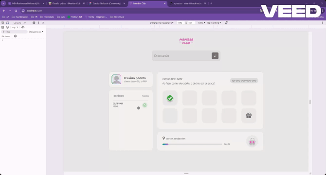

# rocketseat-member-club

Desafio prático do módulo 01 do MBA Rocketseat Full-stack

[Figma](<https://www.figma.com/design/kjMzbdxchQ0Mg31G2gpQmg/Cart%C3%A3o-fidelidade-(Community)?node-id=3-376&t=tqWWIJdaAweAgvJn-1>)

### How to run

1. Run `npm i` (min node version required v18)
2. Run `npm run server` to start JSON Server
3. Open a second terminal
4. Run `npm run build` to compile and bundle files to `dist` folder
5. Run `npm run dev` to start **webpack-dev-server**

### Preview

